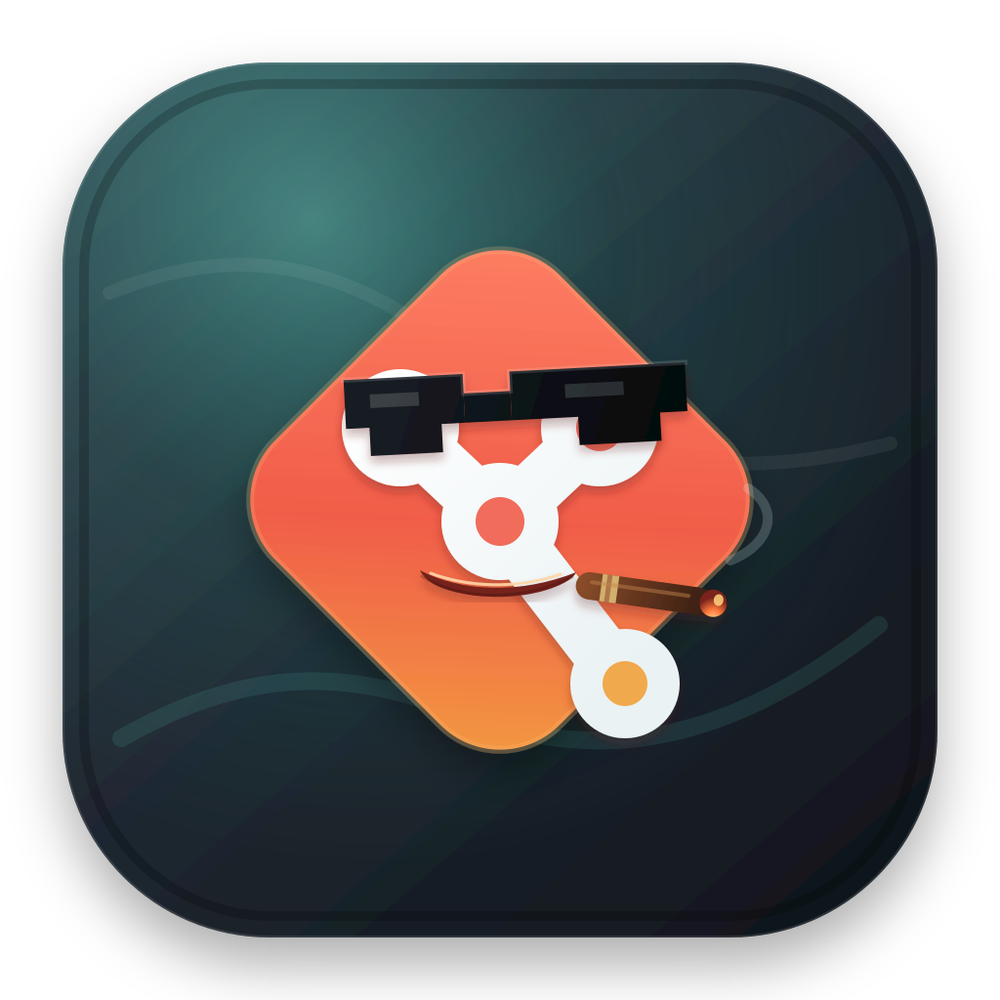
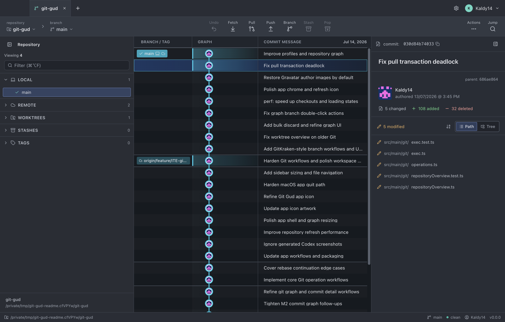
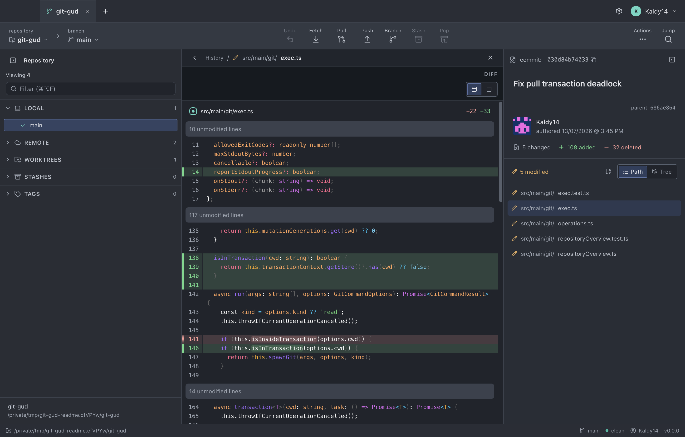
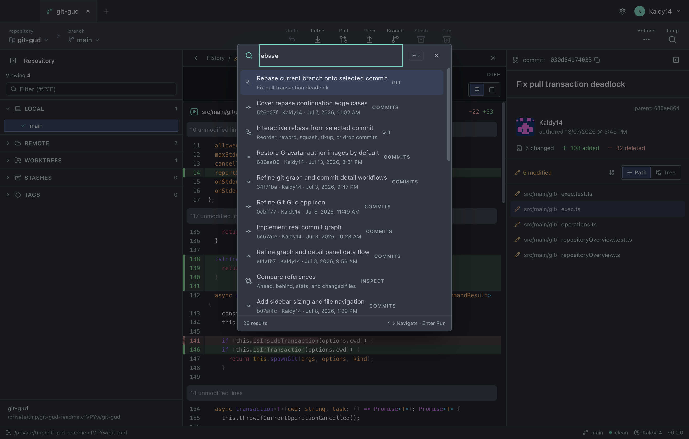

<div align="center">
  
  <h1>Git Gud</h1>
  <p><strong>A fast, local-first desktop Git client.</strong></p>
  <p>Currently supported on macOS.</p>
  <p>Understand history, stage precise changes, and run everyday Git workflows without leaving your flow.</p>

  <p>
    
    
    
    
  </p>
</div>



Git Gud is a focused desktop Git client inspired by the strongest parts of GitKraken's local workflow. It uses your installed Git, existing SSH agent, credential helpers, and repository configuration. No hosted account is required.

> [!IMPORTANT]
> macOS is currently the only supported release platform, not a fundamental limitation of the Electron application. The current source version is `0.4.9`; Windows and Linux builds have not yet been adapted or release-tested.

## Highlights

- **Readable history:** a virtualized commit graph with branches, remotes, tags, worktrees, stashes, and working-directory state.
- **Focused review:** commit metadata, changed-file path/tree views, file history, blame, ref comparison, unified or split diffs, and aggregate inspection across a selected commit range.
- **Codex handoff:** select code in a diff, right-click, add a follow-up question, and open a prefilled task in Codex for the same local repository.
- **Precise staging:** stage or unstage files, hunks, and line groups; discard changes with confirmation; commit and amend in place.
- **Everyday Git operations:** fetch, pull, push, branch, checkout, merge, tag, stash, cherry-pick, revert, and reset.
- **Rebase workflows:** standard and interactive rebase with reorder, reword, squash, fixup, drop, and conflict recovery.
- **Safer mutations:** serialized operations, progress reporting, explicit destructive-action confirmation, and operation-aware local undo.
- **Workspace flow:** multiple repository tabs, restored sessions, per-repository Git profiles, resizable panels, keyboard navigation, and a command palette.

## Screenshots

### Syntax-highlighted diffs

Inspect a commit without losing graph context. Switch between unified and split layouts, or drill into working-directory changes for staging.



### Command palette

Press <kbd>⌘</kbd> <kbd>P</kbd> to search actions, commits, branches, repositories, stashes, and worktrees from one keyboard-first surface.



## Requirements

- macOS for the currently supported application build
- [Git](https://git-scm.com/) available on `PATH`
- Node.js `^20.19.0` or `>=22.12.0`
- pnpm `11.9.0` (Corepack recommended)
- [Codex](https://openai.com/codex/) desktop app (optional, for the diff handoff)

## Run from source

```bash
git clone https://github.com/Kaldy14/git-gud.git
cd git-gud
corepack enable
pnpm install --frozen-lockfile
pnpm dev
```

The app reads Git identity, authentication, and signing settings from the same places as the command line, including repository config, `~/.gitconfig`, SSH agent state, macOS Keychain helpers, and configured GitHub CLI profiles.

## Releases

Every pushed version tag matching `v*` runs the [release workflow](.github/workflows/release.yml). The workflow requires the tag to match the version in `package.json`, runs the full verification suite, and then publishes a [GitHub Release](https://github.com/Kaldy14/git-gud/releases) containing:

- An Apple Silicon (`arm64`) macOS application archive
- An Intel (`x64`) macOS application archive
- A SHA-256 checksum for each archive

Release archives are signed with a Developer ID Application certificate, notarized by Apple, and stapled before they are published. This allows Gatekeeper to verify the application when users install it, including when they are offline.

The release workflow requires these GitHub Actions secrets:

- `MACOS_CERTIFICATE_P12_BASE64`: a base64-encoded, password-protected `.p12` containing the Developer ID Application certificate and private key
- `MACOS_CERTIFICATE_PASSWORD`: the `.p12` export password
- `APPLE_API_KEY_P8_BASE64`: a base64-encoded App Store Connect Team API `.p8` key with App Manager access
- `APPLE_API_KEY_ID`: the App Store Connect API key ID
- `APPLE_API_ISSUER`: the App Store Connect API issuer UUID

The `.p12` performs code signing. The App Store Connect `.p8` key is separate and is used only to authenticate notarization. Configure these values under **Repository settings → Secrets and variables → Actions** before pushing a release tag.

To prepare a release, update `package.json` and [CHANGELOG.md](CHANGELOG.md), commit the changes, and push a matching tag:

```bash
git tag v0.4.2
git push origin v0.4.2
```

## Build the macOS app locally

```bash
pnpm dist
open "dist/mac/Git Gud.app"
```

`pnpm dist` runs the full production build, assembles `dist/mac/Git Gud.app`, and applies an ad-hoc signature for local use. To make a local Developer ID build, install the certificate in a keychain and set its identity before running the command:

```bash
MACOS_SIGNING_IDENTITY="Developer ID Application: Your Name (TEAMID)" pnpm dist
```

Set `MACOS_SIGNING_KEYCHAIN` as well when the identity is stored in a non-default keychain. Tag-driven builds import the certificate into an ephemeral CI keychain, sign with the hardened runtime enabled, notarize and staple the app, verify it with `codesign`, `stapler`, and Gatekeeper, then package and publish it.

## Development

| Command | Purpose |
| --- | --- |
| `pnpm dev` | Start Electron with live reload |
| `pnpm typecheck` | Check main, preload, and renderer TypeScript |
| `pnpm lint` | Run ESLint across the repository |
| `pnpm test` | Run the Vitest suite |
| `pnpm build` | Typecheck and create production bundles |
| `pnpm dist` | Build the local macOS application bundle |

Before opening a pull request, run:

```bash
pnpm typecheck
pnpm lint
pnpm test
pnpm build
```

## Architecture

```text
React renderer (sandboxed)
  ├─ TanStack Query for Git-backed reads
  ├─ Zustand for workspace state
  └─ @pierre/trees + @pierre/diffs for file review
              │
              ▼ typed window.api
Electron preload (context bridge)
              │
              ▼ validated IPC
Electron main process
  ├─ repository inspection and filesystem watchers
  ├─ per-repository mutation queue and progress events
  ├─ profile, workspace, settings, and undo persistence
  └─ system Git processes using the user's environment
```

The renderer has no Node.js access and never executes Git directly. Shared TypeScript contracts define the IPC boundary, while validation and repository-scope checks run in the main process.

See [docs/README.md](docs/README.md) for the renderer map and graph model, [PRODUCT.md](PRODUCT.md) for product principles, and [PLAN.md](PLAN.md) for milestone history and deeper implementation notes.

## Project scope

Git Gud deliberately prioritizes local repository work. Pull-request dashboards, issue tracking, teams, cloud patches, embedded AI generation, auto-updates, and App Store distribution are not current goals. The Codex integration is an explicit handoff to the separately installed desktop app: Git Gud prepares repository and code context, but does not submit the prompt or run an AI model itself. Windows and Linux support is possible, but requires platform-specific system integration, packaging, and CI coverage before those builds can be supported.

## Contributing

Issues and focused pull requests are welcome. Please keep changes small, include tests for Git behavior or parser changes, update documentation when user-visible behavior changes, and verify the checks above before submitting.

When reporting a bug, include the Git Gud action, expected result, actual result, macOS and Git versions, and a minimal repository shape when possible. Remove credentials, remote URLs, and private paths from logs before posting them.
