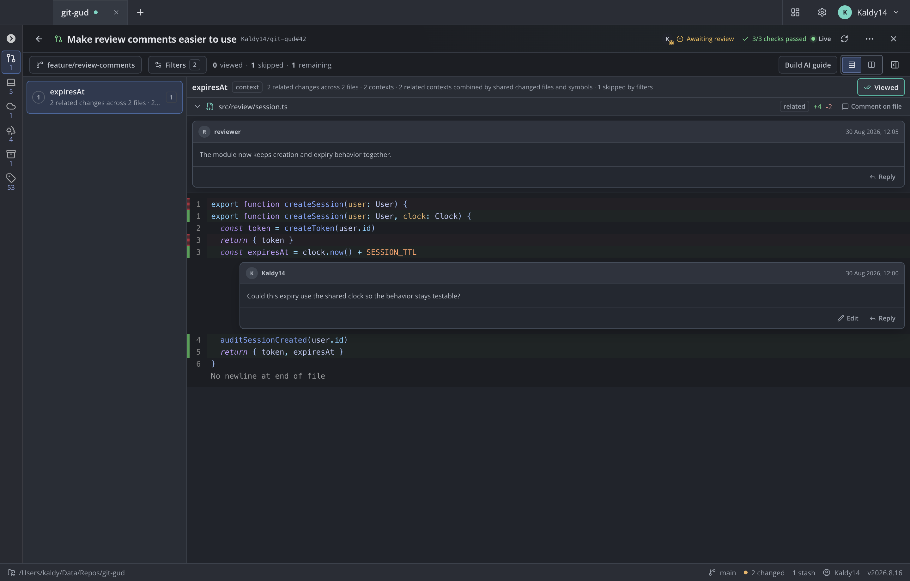
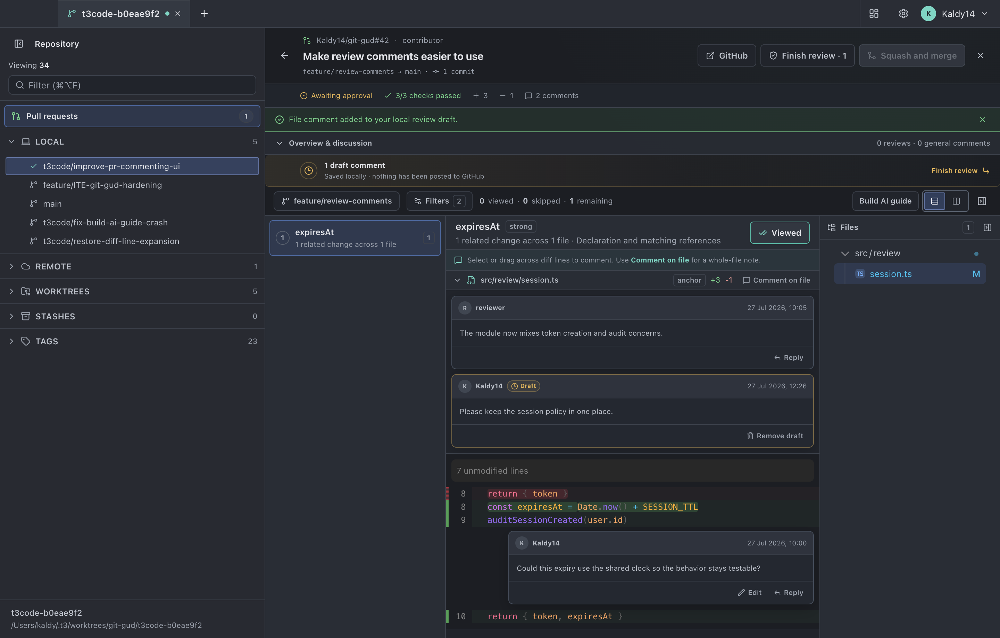
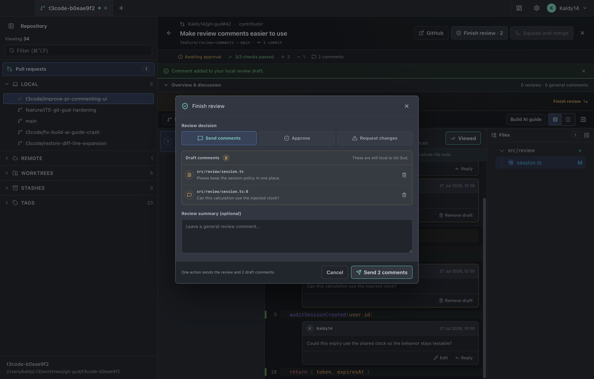
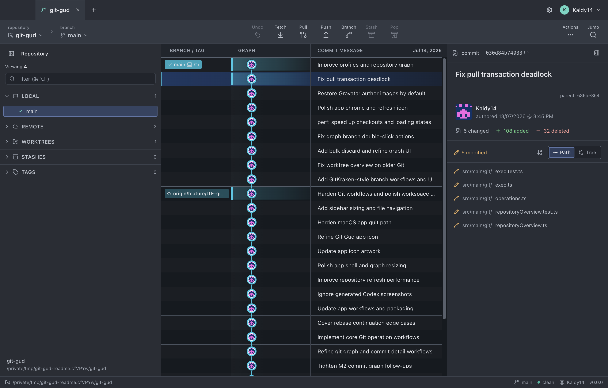
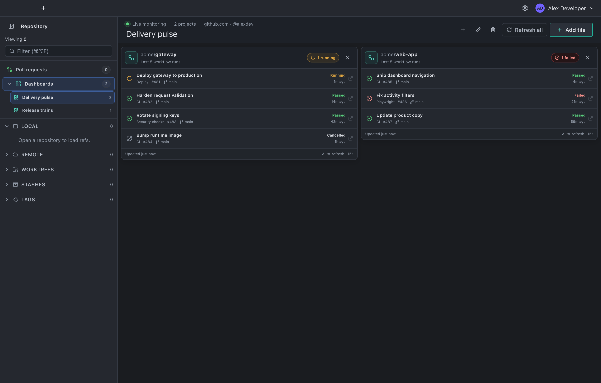
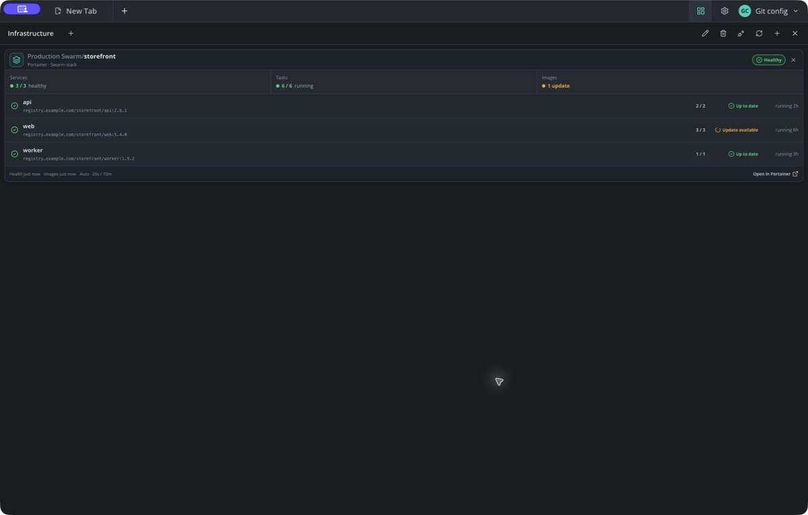
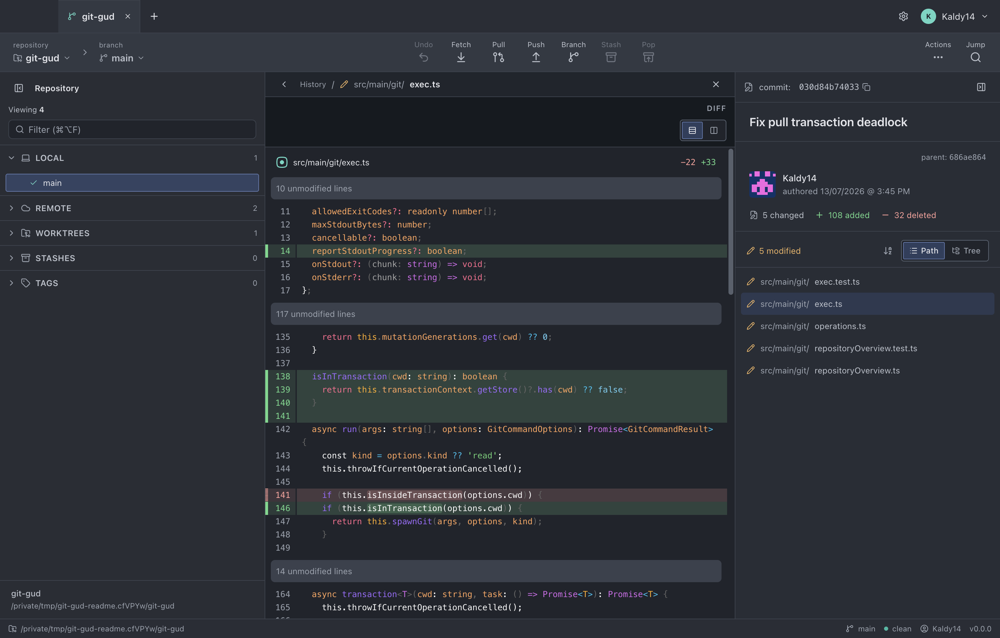
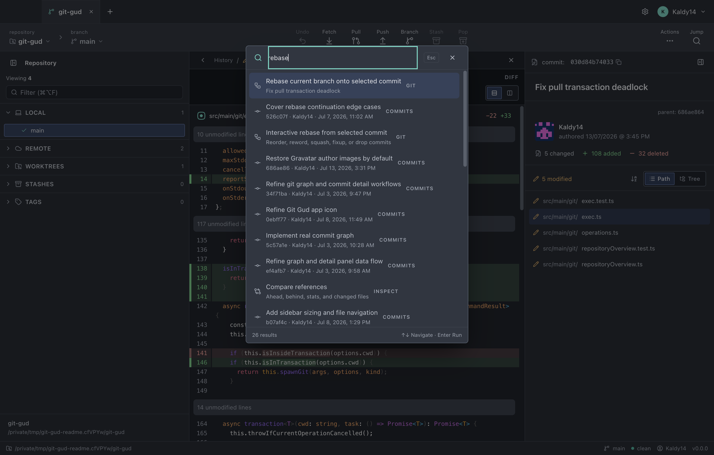

<div align="center">
  
  <h1>Git Gud</h1>
  <p><strong>A fast, local-first desktop Git client.</strong></p>
  <p>Supported on macOS, with experimental Windows builds.</p>
  <p>Review whole changes as connected stories, then run everyday Git workflows without leaving your flow.</p>

  <p>
    
    <a href="https://github.com/Kaldy14/git-gud/releases/latest"></a>
    
    
    
  </p>
</div>



Git Gud is a focused desktop Git client inspired by the strongest parts of GitKraken's local workflow. It uses your installed Git, existing SSH agent, credential helpers, and repository configuration. Local repository work does not require a hosted account.

> [!IMPORTANT]
> macOS is the fully supported release platform. GitHub Releases also include an experimental, unsigned Windows x64 portable executable; Windows-specific integrations have not yet been fully adapted or release-tested. Linux builds are not currently provided.

## Review the change, not the file list

Most Git clients present a pull request as an alphabetized stack of files. That is faithful to the patch, but it makes the reviewer reconstruct the change in their head. A single feature may begin in a migration, change a type or GraphQL field, pass through generated code, alter an implementation, and finish in tests several folders away.

Git Gud builds a deterministic review plan for the whole pull request. It splits the patch into hunks, reads TypeScript and GraphQL structure with Tree-sitter, and connects declarations, usages, renames, shared symbols, and matching schema fields. Related hunks become a change story even when they live in different files.

Within each story, Git Gud puts storage changes and definitions first, followed by APIs, generated code, implementation, tests, and translations. Every changed hunk belongs to exactly one story. The confidence label explains how strong the connection is, while the file tree, search, filters, and unified or split diff remain available when file order is the better tool.

The review plan appears immediately and does not depend on AI. The optional background guide uses that exact plan to summarize intent and suggest where to start, without replacing or reordering the underlying evidence.

Draft line, file, and reply comments stay local until the review is ready:



The final step publishes the selected decision and all local drafts together:



## Features

- **Whole-change review.** Review a commit, a selected commit range, the working directory, an entire branch, or a pull request as connected change stories. Use the resizable file tree, whole-review search, persistent filters, viewed progress, keyboard file navigation, expandable surrounding code, TypeScript definition previews, and unified or split diffs.
- **Repository setup and workspaces.** Open an existing repository, initialize a new one, or clone from a URL or GitHub repository name. Search recent repositories, keep several tabs open, reorder them, restore the last session per profile, and recover a removed linked worktree by returning to its base repository.
- **Readable history.** Browse a virtualized commit graph with local and remote branches, tags, linked worktrees, stashes, and working-directory rows. Search commits, select a range, inspect merge structure, and see staged, unstaged, untracked, and conflicted file counts before opening a diff.
- **Precise working-copy control.** Stage or unstage files and individual diff hunks. File menus can stash, discard, ignore, copy the path, open or reveal the file, and jump to history or blame. Commit staged work, amend `HEAD`, edit the current `HEAD` message, or generate a message from the staged diff and recent repository style.
- **Pull-request review.** Work from a GitHub inbox grouped by next action. Inspect status, checks, commits, threaded discussion, review history, merge conflicts, and image attachments beside the diff. Draft line or file comments and replies locally, then comment, approve, request changes, or merge with the methods enabled by the repository.
- **Pull-request worktrees and links.** Open the exact pull-request head in an isolated managed worktree without switching the main checkout, then launch it in a detected editor or terminal. Copy a shareable Git Gud link to reopen the same review. Dirty managed worktrees are preserved instead of being removed.
- **Branches, remotes, and releases.** Organize slash-delimited branch names as folders, create or rename branches, set upstreams, and push a selected branch without checking it out. Add, edit, fetch, rename, or remove remotes. Create annotated tags, use calendar-based tag suggestions, push a branch and its suggested tag together, and delete local or remote branches and tags with scoped confirmation.
- **Sync and stash workflows.** Choose fetch, merge-based pull, fast-forward-only pull, or rebase pull as the main sync action. Push the current branch, prune remote references, create selective stashes that include chosen tracked or untracked files, and apply, pop, or drop saved work.
- **Rebase and conflict recovery.** Merge, cherry-pick ordered selections, revert, reset, and run standard or interactive rebases with reorder, reword, squash, fixup, and drop. The conflict resolver shows ours and theirs, supports per-marker choices and manual output editing, stages resolved files, and continues, skips, or aborts the active operation.
- **GitHub Actions and Portainer dashboards.** Build profile-scoped dashboards from editable and reorderable tiles. GitHub Actions tiles can show recent runs for selected branches or tags, or group the latest workflow attempts for pull requests you authored. Open a run inside Git Gud to inspect its job graph, steps, and failed-step logs. Portainer tiles monitor Swarm and Compose stacks, replicas or containers, service health, and deployed images.
- **Codex and AI assistance.** Install the Git Gud Agent Notes skill once, then let Codex attach occasional implementation context to changed lines from tasks started anywhere. Open selected diff lines as a prefilled Codex task without submitting it. Pull-request drafts can be copied as a bounded review prompt for use in Codex or another assistant. A locally installed Pi CLI powers optional background review walkthroughs and staged-diff commit-message generation.
- **Safety, profiles, and updates.** Git mutations run in a per-repository queue with progress and cancellation. Destructive actions require confirmation, useful local operations record undo data, ignored local files are protected from overwrite, and rejected pushes can use a revision-checked force push with lease. Profiles isolate Git identity, signing, SSH, GitHub CLI settings, tabs, recent repositories, and dashboards. Packaged macOS releases update in the background and install only after an explicit restart.

## More screenshots

### Commit history

Read branches, remotes, tags, worktrees, stashes, and working-directory state in one virtualized graph without losing the selected commit's files and metadata.



### Live GitHub Actions dashboards

Create persistent dashboards for several projects, filter the runs shown by each tile, and see queued, running, and failed workflows update automatically. Open a run inside Git Gud to inspect its jobs, steps, and failure logs, or follow the link to GitHub.



### Portainer stack monitoring

Monitor Swarm and Compose stacks alongside delivery workflows, including service health, replicas or containers, image freshness, and links back to Portainer.



### Syntax-highlighted diffs

Inspect a commit without losing graph context. Switch between unified and split layouts, or drill into working-directory changes for staging.



### Command palette

Press <kbd>⌘</kbd> <kbd>P</kbd> to search actions, commits, branches, repositories, stashes, and worktrees from one keyboard-first surface.



## Requirements

- macOS for the fully supported application build, or Windows x64 for the experimental portable build
- [Git](https://git-scm.com/) available on `PATH`
- Node.js `^20.19.0` or `>=22.12.0`
- pnpm `11.9.0` (Corepack recommended)
- [GitHub CLI](https://cli.github.com/) with a connected account (optional, for pull requests and GitHub Actions dashboards)
- [Codex](https://openai.com/codex/) desktop app (optional, for diff and pull-request review handoffs)
- Pi CLI available on `PATH`, or configured through `PI_EXECUTABLE_PATH` (optional, for AI review walkthroughs and commit-message generation)
- Portainer Business Edition API access (optional, for Swarm and Compose stack monitoring)

## Codex Agent Notes

Agent Notes let Codex attach short implementation context directly to changed lines in Git Gud. Most tasks should produce no notes. A note is useful only when the diff cannot explain a constraint, behavior contract, or concrete risk that matters during review.

Open **Settings → Codex** and select **Install skill**. Git Gud installs the bundled `git-gud-agent-notes` skill in `~/.agents/skills`, where local Codex clients can discover it for repositories opened anywhere. This feature does not depend on starting a Codex task from Git Gud.

After an implementation task, the skill asks Codex to inspect its finished diff and decide whether any note is warranted. When one is, the skill's bundled writer validates the changed line, captures a stable anchor, and stores the note in that worktree's Git metadata. Git Gud watches the repository and shows the note inline. Hiding a read note collapses it to a small marker that can be reopened later.

The integration is local and optional. Git Gud never changes a repository's `AGENTS.md`, never adds note files to the working tree, and leaves an existing unmanaged skill with the same name untouched. See [docs/agent-notes.md](docs/agent-notes.md) for the exact authoring rules, command, storage behavior, and limitations.

## Run from source

```bash
git clone https://github.com/Kaldy14/git-gud.git
cd git-gud
corepack enable
pnpm install --frozen-lockfile
pnpm dev
```

The app reads Git identity, authentication, and signing settings from the same places as the command line, including repository config, `~/.gitconfig`, SSH agent state, macOS Keychain helpers, and configured GitHub CLI profiles.

## Releases

Every pushed version tag matching `v*` runs the [release workflow](.github/workflows/release.yml). The workflow derives the packaged application version from the tag, runs the full verification suite, and then publishes a [GitHub Release](https://github.com/Kaldy14/git-gud/releases) containing:

- An Apple Silicon (`arm64`) macOS application archive
- An Intel (`x64`) macOS application archive
- An unsigned, portable Windows (`x64`) executable
- A SHA-256 checksum for each release artifact

The macOS release archives are signed with a Developer ID Application certificate, notarized by Apple, and stapled before they are published. This allows Gatekeeper to verify the application when users install it, including when they are offline.

The release workflow requires these GitHub Actions secrets:

- `MACOS_CERTIFICATE_P12_BASE64`: a base64-encoded, password-protected `.p12` containing the Developer ID Application certificate and private key
- `MACOS_CERTIFICATE_PASSWORD`: the `.p12` export password
- `APPLE_API_KEY_P8_BASE64`: a base64-encoded App Store Connect Team API `.p8` key with App Manager access
- `APPLE_API_KEY_ID`: the App Store Connect API key ID
- `APPLE_API_ISSUER`: the App Store Connect API issuer UUID

The `.p12` performs code signing. The App Store Connect `.p8` key is separate and is used only to authenticate notarization. Configure these values under **Repository settings → Secrets and variables → Actions** before pushing a release tag.

To prepare a release, update [CHANGELOG.md](CHANGELOG.md), make sure the release commit is on `main`, and push the next version tag:

```bash
release_tag=vX.Y.Z
git tag "$release_tag"
git push origin "$release_tag"
```

## Build the macOS app locally

```bash
GIT_GUD_VERSION="$(git describe --tags --abbrev=0)" pnpm dist
open "dist/mac/Git Gud.app"
```

`pnpm dist` runs the full production build, assembles `dist/mac/Git Gud.app`, and applies an ad-hoc signature for local use. `GIT_GUD_VERSION` controls the version embedded in the application; without it, local builds use `0.0.0`. To make a local Developer ID build, install the certificate in a keychain and set its identity before running the command:

```bash
GIT_GUD_VERSION="$(git describe --tags --abbrev=0)" \
  MACOS_SIGNING_IDENTITY="Developer ID Application: Your Name (TEAMID)" \
  pnpm dist
```

Set `MACOS_SIGNING_KEYCHAIN` as well when the identity is stored in a non-default keychain. Tag-driven builds import the certificate into an ephemeral CI keychain, sign with the hardened runtime enabled, notarize and staple the app, verify it with `codesign`, `stapler`, and Gatekeeper, then package and publish it.

## Development

| Command | Purpose |
| --- | --- |
| `pnpm dev` | Start Electron with live reload |
| `pnpm typecheck` | Check main, preload, and renderer TypeScript |
| `pnpm lint` | Run ESLint across the repository |
| `pnpm test` | Run the Vitest suite |
| `pnpm benchmark:review` | Score review-chunk grouping against the benchmark datasets |
| `pnpm build` | Typecheck and create production bundles |
| `pnpm dist` | Build the local macOS application bundle |
| `pnpm dist:windows` | Build the portable Windows x64 executable (on Windows) |

Before opening a pull request, run:

```bash
pnpm typecheck
pnpm lint
pnpm test
pnpm build
```

## Architecture

```text
React renderer (sandboxed)
  ├─ TanStack Query for Git-backed reads
  ├─ Zustand for workspace state
  └─ @pierre/trees + @pierre/diffs for file review
              │
              ▼ typed window.api
Electron preload (context bridge)
              │
              ▼ validated IPC
Electron main process
  ├─ repository inspection and filesystem watchers
  ├─ per-repository mutation queue and progress events
  ├─ profile, workspace, dashboard, connection, settings, and undo persistence
  ├─ GitHub CLI-backed pull requests and Actions monitoring
  ├─ Portainer API-backed Swarm and Compose monitoring
  ├─ managed pull-request worktrees and external application launch
  ├─ Pi CLI-backed review guides and commit-message generation
  └─ system Git processes using the user's environment
```

The renderer has no Node.js access and never executes Git directly. Shared TypeScript contracts define the IPC boundary, while validation and repository-scope checks run in the main process.

See [docs/README.md](docs/README.md) for the renderer map and graph model, [docs/agent-notes.md](docs/agent-notes.md) for the Codex skill integration, [PRODUCT.md](PRODUCT.md) for product principles, and [PLAN.md](PLAN.md) for milestone history and deeper implementation notes.

## Project scope

Git Gud prioritizes local repository work, with focused GitHub pull-request and Actions support through an already-connected GitHub CLI profile and optional Portainer stack monitoring. It does not host repositories, manage issues or teams, patch cloud services, or publish automated review comments. AI actions are opt-in: Git Gud can install its local Codex Agent Notes skill, run the locally installed Pi CLI for review walkthroughs and commit messages, open selected code in a prefilled Codex task, or copy local pull-request drafts as a prompt. It does not auto-submit Codex tasks or copied review drafts. Windows remains experimental, and Linux needs platform integration, packaging, and CI coverage before it can be supported.

## Acknowledgements

Thank you to the [GitKraken](https://www.gitkraken.com/) team for inspiring Git Gud's approach to visual history and everyday Git workflows. Git Gud is an independent project and is not affiliated with or endorsed by GitKraken.

## Contributing

Issues and focused pull requests are welcome. Please keep changes small, include tests for Git behavior or parser changes, update documentation when user-visible behavior changes, and verify the checks above before submitting.

When reporting a bug, include the Git Gud action, expected result, actual result, macOS and Git versions, and a minimal repository shape when possible. Remove credentials, remote URLs, and private paths from logs before posting them.
